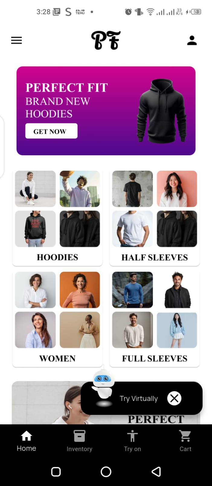

<h1 align="center">👋 Welcome to Haroon's GitHub</h1>

<h3 align="center">📈 My GitHub Activity</h3>

  
  &nbsp;&nbsp;&nbsp;&nbsp;&nbsp; <!-- adds space between images -->
  

### 🚀 Featured Projects

  
  
  
  

