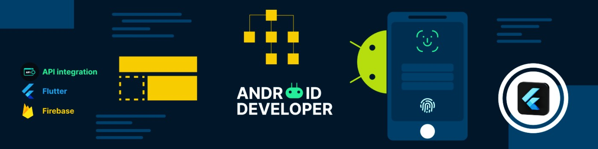
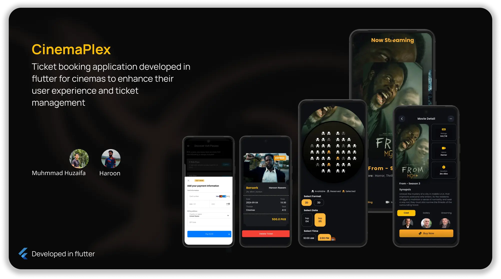
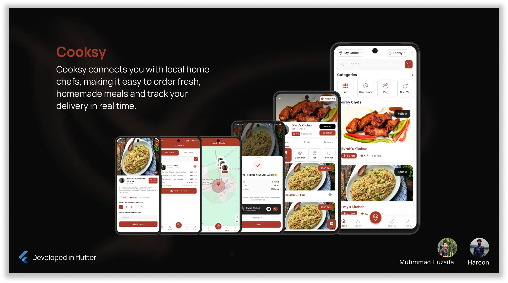
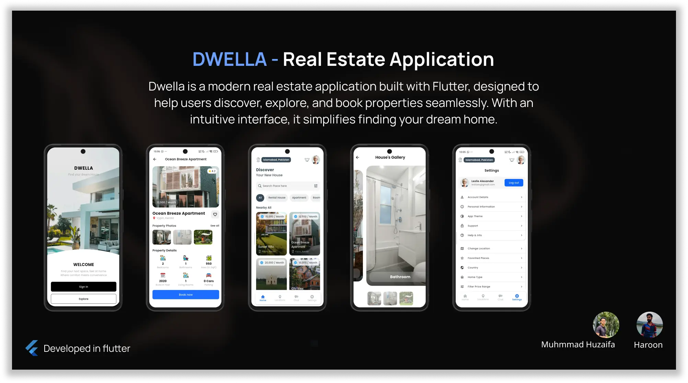
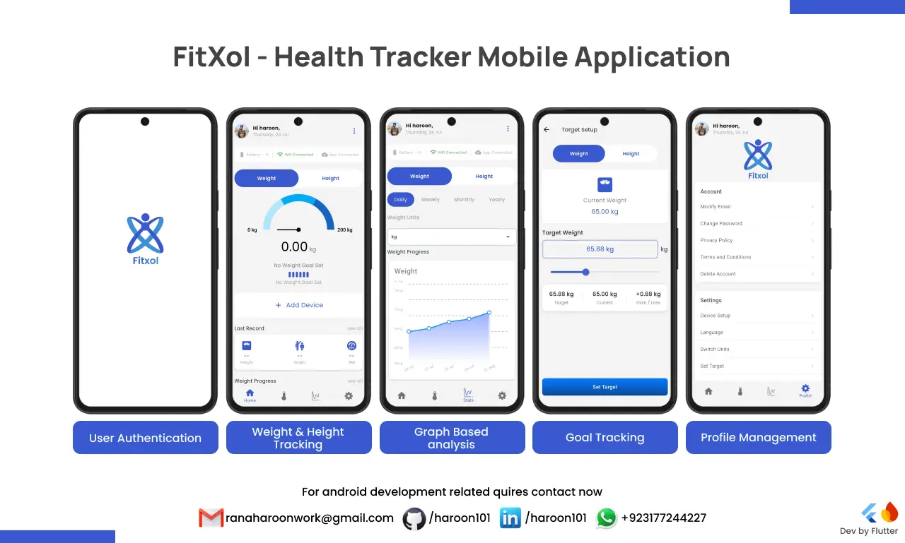
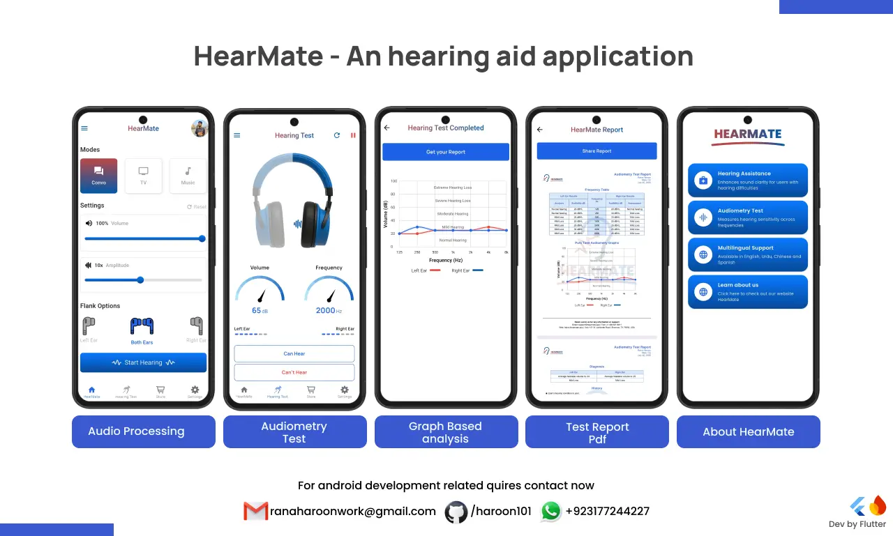
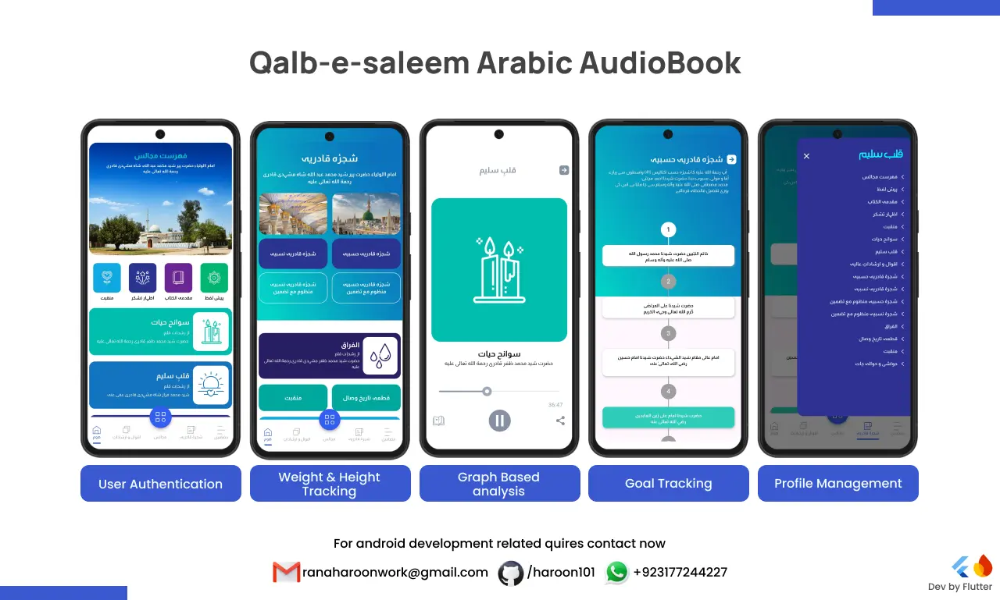
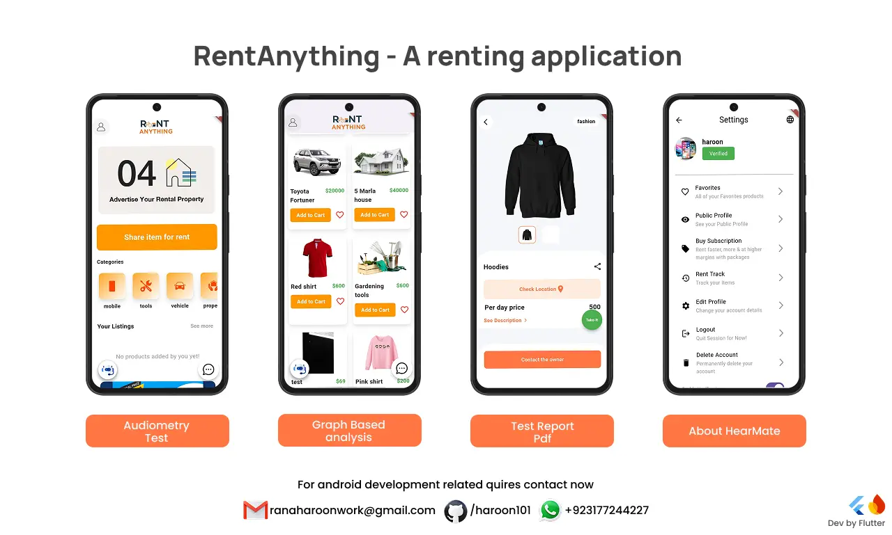
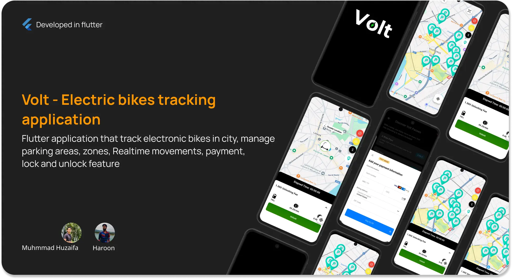
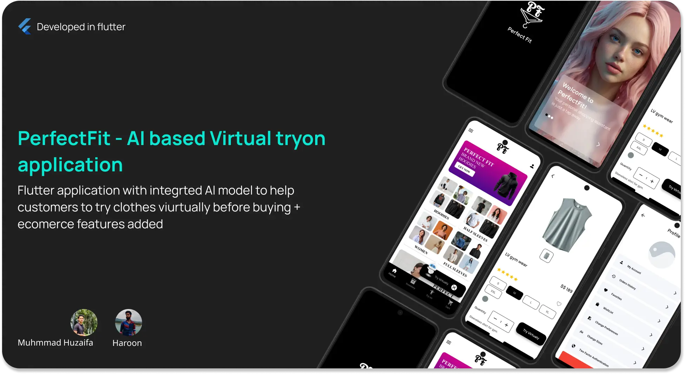

<h1 align="center">👋 Hey, I'm Haroon</h1>

  🚀 Flutter Developer | Building Clean & Useful Apps

  

---

<h2 align="center">🚀 My Projects</h2>

<table>
  <tr>
    <td align="center">
       
      <b>CinemaPlex</b> 
      Movie browsing app
    </td>
    <td align="center">
       
      <b>Cooksy</b> 
      Food ordering app
    </td>
    <td align="center">
       
      <b>Dwella</b> 
      Real estate app
    </td>
  </tr>

  <tr>
    <td align="center">
       
      <b>FitXol</b> 
      Health tracker
    </td>
    <td align="center">
       
      <b>HearMate</b> 
      Hearing aid app
    </td>
    <td align="center">
       
      <b>Qalb</b> 
      Audiobook app
    </td>
  </tr>

  <tr>
    <td align="center">
       
      <b>RentAnything</b> 
      Rental marketplace
    </td>
    <td align="center">
       
      <b>Volt</b> 
      Bike tracking
    </td>
    <td align="center">
       
      <b>PerfectFit</b> 
      AI try-on
    </td>
  </tr>
</table>

---

<h2 align="center">🛠 Tech Stack</h2>

  

---

<h2 align="center">📫 Connect</h2>

  <a href="#">LinkedIn</a> •
  <a href="#">Portfolio</a>

